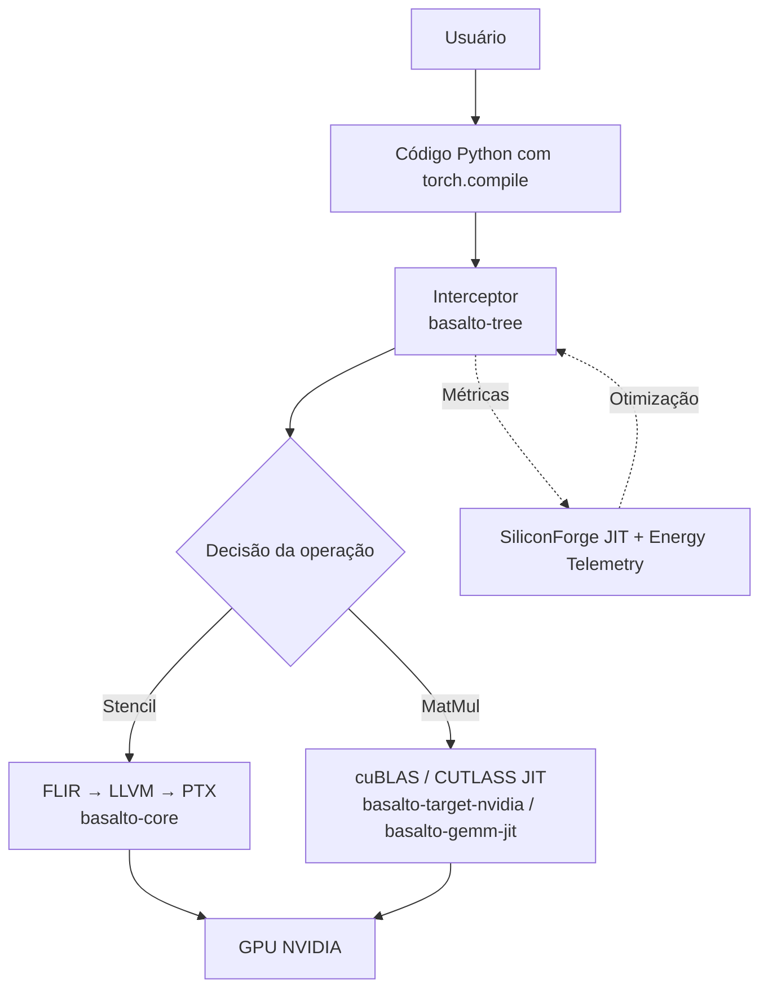

Aqui está um `README.md` mais moderno, com uma arquitetura visualmente mais clara e um diagrama Mermaid redesenhado para caber todo o texto sem cortes. Também ajustei a formatação para torná-lo mais direto e legível.

---

# Basalto – Um compilador para o desempenho máximo de GPUs

[](https://github.com/basaltotech/bs-compiler/actions/workflows/ci.yml)
[](LICENSE)

**Basalto** é um compilador JIT (Just‑In‑Time) para GPUs que acelera simulações científicas e modelos de IA com um único código‑fonte, independente do fabricante do hardware.  

Inspirado na rocha vulcânica que se forma ao resfriar rapidamente, o Basalto transforma código de alto nível em kernels nativos e otimizados para NVIDIA, AMD e Intel (atualmente com suporte completo para NVIDIA).

---

## ✨ Características

- **🖥️ Suporte multi‑fabricante:** Compila para NVIDIA (CUDA), AMD (ROCm) e Intel (OneAPI) – *hoje focado em NVIDIA*.
- **⚙️ Compilação JIT inteligente:** Stencils 1D/2D/3D com tiling X‑Y, loop Z e memória compartilhada.
- **🚀 MatMul otimizado:** Uso de cuBLAS (Tensor Cores) e CUTLASS JIT com fusão de bias/ReLU/GELU/Scale.
- **🌐 Comunicação GPU‑Aware:** Troca de halos via MPI e NCCL com detecção automática de suporte a GPU‑Aware MPI.
- **💾 Cache hierárquico:** L1 (disco local) + L2 (Redis) com LRU e serialização.
- **📊 Telemetria de energia (COUN):** Medição precisa de kWh via NVML/IPMI/Redfish.
- **🔁 Otimização contínua (SiliconForge JIT):** Recalibra parâmetros em background com base em métricas de execução.
- **🧩 Stride View:** Reorganização de memória sem cópia para acesso coalescido.
- **🔐 Instalação simplificada:** Script único `install.sh` que configura sistema, permissões e pacote Python.

---

## 🏗️ Arquitetura resumida



- **`basalto-tree`** – Orquestrador principal (intercepta chamadas, gerencia cache, executa).
- **`basalto-core`** – Núcleo do compilador (FLIR, LLVM IR, stencils).
- **`basalto-target-nvidia`** – Backend NVIDIA (runtime CUDA, geração PTX).
- **`basalto-communication`** – MPI/NCCL para troca de halos.
- **`basalto-gemm-jit`** – Compilação JIT de kernels MatMul com fusão.
- **`siliconforge-jit`** – Otimização contínua em background.
- **`energy-telemetry`** – Medição de energia e correlação (COUN).

---

## 📦 Instalação

### Via script único (recomendado para clusters)

```bash
curl -sSL https://raw.githubusercontent.com/basaltotech/bs-compiler/main/deploy/installer/install.sh | sudo bash
```

Ou baixe o script manualmente:

```bash
wget https://raw.githubusercontent.com/basaltotech/bs-compiler/main/deploy/installer/install.sh
chmod +x install.sh
sudo ./install.sh
```

O script:
- Baixa o binário do instalador e a wheel Python.
- Configura permissões (udev, grupos).
- Cria diretórios de cache, log e configuração.
- Instala o pacote `basalto` (via pip ou em ambiente virtual).

### Via pip (para desenvolvedores)

```bash
pip install git+https://github.com/basaltotech/bs-compiler.git
```

> **Pré‑requisitos:** Python 3.10+, Rust, CUDA Toolkit (>= 11.8), e as bibliotecas `libcuda.so`, `libnvrtc.so`, `libcublas.so` disponíveis no `LD_LIBRARY_PATH`.

---

## 🚀 Uso básico

```python
import torch
import basalto   # registra automaticamente o backend "basalto"

# Exemplo de stencil 1D
@torch.compile(backend="basalto")
def stencil(x):
    return (x[..., :-2] + x[..., 1:-1] + x[..., 2:]) / 3.0

x = torch.randn(1024, device="cuda")
y = stencil(x)   # primeira execução compila, as seguintes usam cache
```

```python
# Exemplo de MatMul (usa cuBLAS automaticamente)
@torch.compile(backend="basalto")
def matmul(a, b):
    return torch.matmul(a, b)

a = torch.randn(256, 512, device="cuda")
b = torch.randn(512, 128, device="cuda")
c = matmul(a, b)
```

### Opções adicionais

- **Cache L2 (Redis):** Edite `/etc/basalto/config.toml` e ative `[redis] enabled = true`.
- **Auditoria (COUN):** Defina `BASALTO_AUDIT_ENABLED=true` no ambiente.
- **Logs:** Consulte `/var/log/basalto/basalto.log`.

---

## 📁 Estrutura do projeto

```text
bs-compiler/
├── crates/
│   ├── basalto-common/          # Utilitários (hardware, permissões, config)
│   ├── basalto-core/            # Núcleo do compilador (FLIR, LLVM, stencils)
│   │   └── src/ir/              # Geradores de IR: 1D, 2D, 3D, Tensor Core, Checkpoint
│   ├── basalto-target-nvidia/   # Backend NVIDIA (runtime, codegen, blas)
│   ├── basalto-target-amd/      # Backend AMD   (stub)
│   ├── basalto-target-intel/    # Backend Intel (stub)
│   ├── basalto-tree/            # Orquestrador (interceptor, executor, cache)
│   ├── basalto-communication/   # MPI, NCCL, CUDA Runtime, troca de halos
│   ├── basalto-gemm-jit/        # MatMul JIT com CUTLASS e NVRTC
│   ├── basalto-gems/            # Stride View (reorganização de memória)
│   ├── siliconforge-jit/        # Otimização contínua (profiler, optimizer, compiler)
│   ├── energy-telemetry/        # Medição de energia e correlação (COUN)
│   └── basalto-installer/       # Instalador Rust (configuração do sistema)
├── python/                      # Bindings PyO3 e módulo Python
│   ├── basalto/
│   │   ├── __init__.py
│   │   ├── compiler.py          # Backend para torch.compile
│   │   └── _rust.pyi            # Stubs de tipagem
│   └── Cargo.toml
├── deploy/installer/install.sh  # Script de instalação completo
├── .github/workflows/           # CI/CD
├── Cargo.toml                   # Workspace Rust
├── pyproject.toml               # Configuração do maturin
└── README.md                    # Este arquivo
```

---

## 🔧 Desenvolvimento

### Compilar do zero

```bash
git clone https://github.com/basaltotech/bs-compiler.git
cd bs-compiler
cargo build --release
```

### Construir a wheel Python

```bash
maturin build --release
pip install target/wheels/basalto-*.whl
```

### Executar testes

```bash
cargo test
python -m pytest python/tests/
```

---

## 📄 Licença

Este projeto é distribuído sob a licença MIT. Consulte o arquivo [LICENSE](LICENSE) para mais detalhes.

---

## 🙋 Contribuições

Contribuições são bem‑vindas! Abra uma issue ou envie um pull request. Para grandes mudanças, discuta‑as primeiro através de uma issue.

---

## 📞 Contato

Para dúvidas técnicas ou suporte, entre em contato com a equipe Basalto Tech.

---

**Basalto – a camada que une o código científico à velocidade máxima do silício.**